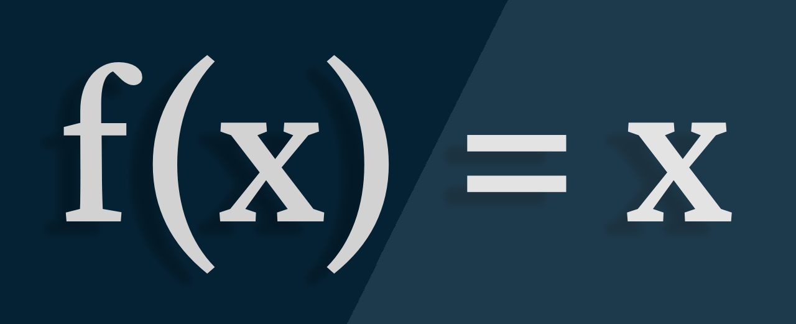

# The Identity

A large, unnecessary identity function written in go.

## Why?

Because it's fun to do something unecessary in a creative way :) You have probably written enough code that was supposed to be "useful".

Inspired by [The Art of Code](https://www.youtube.com/watch?v=6avJHaC3C2U).

## Constraints

- Input range: -1000 to 1000 (inclusive)

## Contributing

### Guidelines

- *Experience is not required*. PR's are welcome from anyone, no matter your experience.
- *Try to be readable*. The high level goal here is to make code that is interesting to read (cause it probably won't be that interesting to execute)

### Getting Started

1. Create a new module in the `modules` folder:
   ```go
   // modules/yourmodule/yourmodule.go
   package yourmodule

   func Identity(num int) int {
       // ... do a kickflip
   }
   ```

2. Add your module to the identity chain in `main.go`:
   ```go
   func Identity(num int) int {
       // ...
       result = yourmodule.Identity(result) // Add your module here
       return result
   }
   ```

3. Keep your module self-contained

4. Test your changes:
   - Run `go test -v` to ensure your module maintains the identity property
   - Add new test cases if your module has specific edge cases
